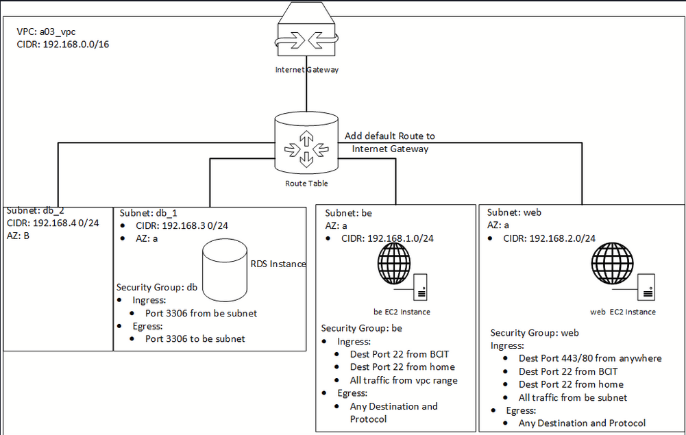
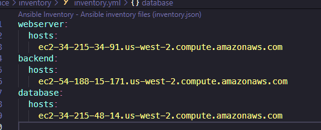
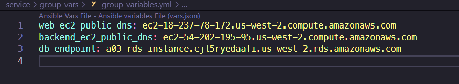
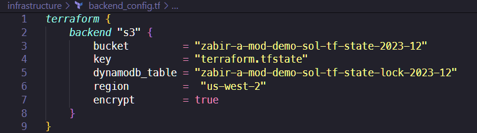
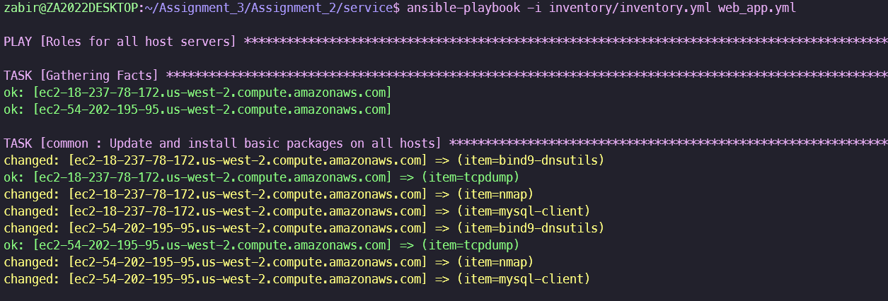
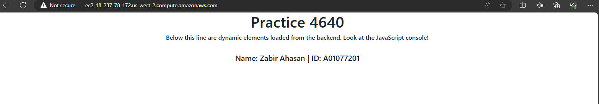

# Assignment 3 

### Project Overview
The goal of this Assignment is to provision an infrastructure and deploy a web application across different EC2 Server instances, using AWS, Terraform Modules, Ansible Roles & Tasks.

It is a continuation of Assignment 2 with several modifications and restructuring.

### Infrastructure & Directory Content: 

The infrastructure is created by Terraform and consists of:

`infrastructure` directory: 

  - `modules`: 

    - `vpc`: - VPC; required infrastructure resources

      - Subnets:

        - Web (Public)
        - Backend (Private)
        - DB_1 (Private)
        - DB_2 (Private)

      - Internet Gateway

      - Route Table & Associations:

        - Web
        - Backend
        - DB_1
        - DB_2

    - `security_group`:

        - Ingress & Egress 
        - Public (Web)
        - Private (Backend)
        - DB (Private - Backend)

    - `ec2`: EC2 Instances (web, database & backend servers) 
      - web instance
      - backend instance 
      - rds (Database) instance

    - `backend_setup`:

      - S3 Bucket + versioning & encryption
      - DynamoDB Table (State Locked)

  - `main.tf` (main file) writes Ansible Host list/group + variables for playbook files

  - `terraform.tfvars` - Input Variables for infrastructure resources 

  - `outputs.tf` - Output of resources created

  - `variables.tf` - Variables for main.tf

  - `provider.tf` - Provider information for Terraform & version

  *Each Module's subdirectory will contain its own, `main.tf`, `outputs.tf` & `variables.tf` files*

  - `backend_config.tf` (produced by backend_setup module) backend db configuration state file

### Service (Application & Ansible) Directory Content:

The application (*https://github.com/timoguic/acit4640-py-mysql.git*) is deployed on the infrastructure using Ansible.  

It uses a main playbook with roles using application configuration files (Jinja2 templates) and handlers, in the `service` directory and consists of:

- `group_vars` directory - will be empty during initial setup 

- `inventory` directory - will be empty during initial setup

- `roles`: - deploys application to the EC2 Instance servers (contains list of tasks for each server)

  - `backend` (backend & database setup)

      - `templates` directory - contains all the configuration files for backend and web server:

        - `backend.conf.j2` - configuration file for backend + db

        - `backend.service.j2` - systemd service file for backend server

      - `vars` directory - contains a `main.yml` file (ENV variables for service and DB configuration)

  - `common` (installs common packages on hosts )

  - `web` (frontend webserver setup)

    - `templates` directory - contains Nginx & frontend html configuration:

      - `nginx.conf.j2` - nginx config file for webserver 
  
- `ansible.cfg` - ansible configuration

- `web_app.yml` (main playbook) 

*Each Role's subdirectory has a `tasks` directory that contains a `main.yml` file to define its tasks*

*The web & backend roles' directories have a `handlers` subdirectory that contains a `main.yml` file (sub task that is run when notified in it's main task file)*

Running the playbook requires `ansible.cfg` file to be configured for ssh connections to the EC2 instances and declaring the inventory variable. 

The inventory file in the `inventory` directory: `inventory.yml` (generated by `main.tf`) is a grouped list of all the hosts with Public DNS addresses. The screenshot is from Assigment 2. 

With the new changes, only the web and backend servers are hosts as the RDS Database is integrated into the backend.  

The `group_variables.yml` (generated by `main.tf`) in the `group_vars` directory, is also similar to the inventory file, but used as variables in the roles' tasks.

#### Roles & Tasks:

backend:

  - Install required packages
  - Create application database
  - Create application user & grant all priviledges
  - Create table for the app & insert data
  - Create group for application
  - Create OS user for application
  - Clone application repository
  - Copy the backend directory to the desired location
  - Ensure backend user owns the backend directory
  - Pip install requirements
  - Copy over backend conf file
  - Create systemd service file
  - Enable & start backend service

  handlers:
    - restart mysql
    - reload & restart systemd service

common:

  - Update and install basic packages on all hosts

web:

  - Install Nginx & Git
  - Create web root dir
  - Configure Nginx
  - Clone repository on webserver
  - Copy to web root location

  handlers:

    - restart nginx

## Requirements & Prerequisites

- AWS account with Admin privileges:
  - https://docs.aws.amazon.com/accounts/latest/reference/welcome-first-time-user.html#getting-started-step1
  - https://docs.aws.amazon.com/SetUp/latest/UserGuide/setup-createadminperms.html

- AWS CLI configured:
  - https://docs.aws.amazon.com/cli/latest/userguide/getting-started-install.html

- Terraform and Ansible installed:
  - https://developer.hashicorp.com/terraform/tutorials/aws-get-started/install-cli
  - https://docs.ansible.com/ansible/latest/installation_guide/intro_installation.html

- Ansible Galaxy Core & AWS Collection:
  - https://galaxy.ansible.com/ui/repo/published/amazon/aws/

### Configuration & Mandatory File Changes

`infrastructure` directory: 

  - Change values in every sub-directory's files & fields: 

        1. `terraform.tfvars`:

          - home_net = "<Your Home IP Address>"
          - ssh_key_name = "<Your SSH Key Name>"

        2. `variables.tf`:

          - variable "home_net" {

            description = "Home CIDR"

            default = "<Your Home IP Address>"

            }

`backend_setup` directory:

  - Change values of S3 Bucket & DynamoDB name fields (must be unique):

    1. `terraform.tfvars`:

      - bucket_name = "<Your Bucket Name>"
      - dynamodb_name = "<Your DB Table Name>"

`service` directory:

  - Change SSH private key file path

    1. `ansible.cfg`:
    
      - private_key_file = <SSH KEY>

# Usage / Instructions

#### Terraform Basic Commands: 

https://developer.hashicorp.com/terraform/cli/commands

- *terraform init* - Initializes the Terraform environment

- *terraform plan* - Displays the infrastructure resources that will be created (Optional)

- *terraform apply* - Creates the infrastructure resources

- *terraform destroy* - Tears down all resources created by Terraform 

## 1. Initialize Backend Configuration (S3 Bucket & DynamoDB)

- Navigate to the `backend_setup` directory

- Initialize Terraform:
  - *terraform init* 

- Apply the Terraform configuration:
   - *terraform apply* - Creates the resources and generates `backend_config.tf` file in the infrastructure's root directory

   

## 2. Setup Infrastructure
- Navigate to the `infrastructure` directory

- Initialize Terraform:
  - *terraform init* 

- Apply the Terraform configuration:
   - *terraform apply* - Creates the resources and generates group_vars/group_variables.yml and inventory/inventory files.

## 3. Deploy Web Application

#### Ansible Basic Commands:
https://docs.ansible.com/ansible/latest/command_guide/cheatsheet.html

- Navigate to the `service` directory

- Run the Ansible playbook
  - *ansible-playbook -i inventory web_app.yml* - Deploys the application and services to the EC2 instances

    

## 3. Access the Web Application

- Retrieve the webserver host's Public DNS address from the `inventory\inventory.yml` file

    
    
- Open a web browser and enter the DNS address

    

## 4. Clean up

- Return to the `infrastructure` directory:

    - *terraform destroy*

- Return to the `backend_setup` directory:

    - *terraform destroy* 